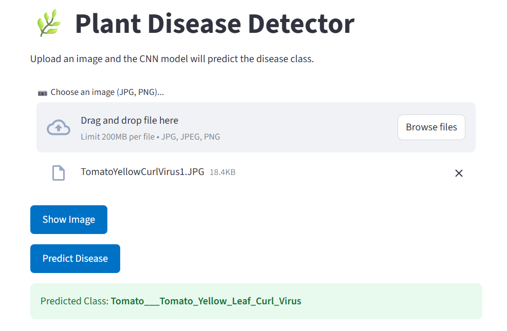
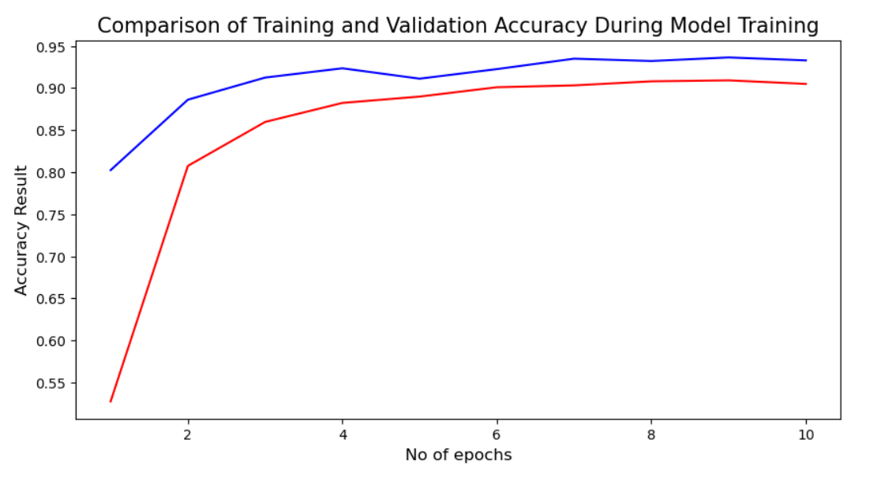

# 🌿 Plant Disease Detector
## 📘 Overview
Leaf Disease Classifier is a **deep learning project** developed in *April 2025* to identify and classify plant leaf diseases from images using a **Convolutional Neural Network (CNN)**. The system combines a high-performing image classification model with an intuitive **Streamlit interface**, allowing users to upload leaf images and receive real-time disease predictions.

Built with TensorFlow/Keras, this tool aids farmers, researchers, and agritech services in **quickly diagnosing crop health** using only a smartphone or desktop browser

## 📌 Problem Statement
**Plant diseases** can severely **affect crop yields and food security**. Traditional disease identification is manual, slow, and often requires expert knowledge, which is not always accessible in rural or resource-limited settings.

**Goal:**
To build a CNN-based image classification model that can **detect the type of disease on a leaf** with high accuracy and provide **immediate results** through an easy-to-use web interface.

## 💡 Features
- 🧬 **Deep CNN model** trained on labeled leaf image dataset
- 📷 Upload image via **Streamlit app** and get prediction instantly
- 🧼 Clean, production-ready code and model **exported as .keras file**

## 🖼️ User Interface Preview
Here’s a look at the interactive Streamlit interface:


## 🧠 Deep Learning Pipeline
```
Leaf Image → Image Preprocessing → CNN Model → Softmax Output → Predicted Disease Class → Streamlit Interface
```

## 📊 Model Performance
- **Training Accuracy**: 90.68%
- **Validation Accuracy**: 93.28%
- **Training Loss**: 0.2936
- **Validation Loss**: 0.2056

The following image shows the training and validation **accuracy and loss** across epochs:


The following table summarizes the detailed **precision, recall, F1-score, and support (number of samples) for each leaf disease class**, showcasing the model’s robust performance across diverse categories.


| Class                                    | Precision | Recall  | F1-Score | Support |
|------------------------------------------|-----------|---------|----------|---------|
| Apple___Apple_scab                       | 0.8656    | 0.9583  | 0.9096   | 504     |
| Apple___Black_rot                        | 0.9795    | 0.9618  | 0.9706   | 497     |
| Apple___Cedar_apple_rust                 | 0.9601    | 0.9295  | 0.9446   | 440     |
| Apple___healthy                         | 0.8824    | 0.9263  | 0.9038   | 502     |
| Blueberry___healthy                      | 0.8525    | 0.9802  | 0.9119   | 454     |
| Cherry_(including_sour)___Powdery_mildew| 0.9648    | 0.9762  | 0.9705   | 421     |
| Cherry_(including_sour)___healthy        | 0.9975    | 0.8882  | 0.9397   | 456     |
| Corn_(maize)___Cercospora_leaf_spot Gray_leaf_spot | 0.9115 | 0.9049 | 0.9082   | 410     |
| Corn_(maize)___Common_rust_              | 0.9875    | 0.9958  | 0.9916   | 477     |
| Corn_(maize)___Northern_Leaf_Blight     | 0.8931    | 0.9455  | 0.9185   | 477     |
| Corn_(maize)___healthy                   | 0.9936    | 1.0000  | 0.9968   | 465     |
| Grape___Black_rot                       | 0.9725    | 0.9746  | 0.9735   | 472     |
| Grape___Esca_(Black_Measles)            | 0.9832    | 0.9750  | 0.9791   | 480     |
| Grape___Leaf_blight_(Isariopsis_Leaf_Spot) | 0.9814 | 0.9791 | 0.9802   | 430     |
| Grape___healthy                         | 0.9718    | 0.9787  | 0.9753   | 423     |
| Orange___Haunglongbing_(Citrus_greening)| 1.0000    | 0.9761  | 0.9879   | 503     |
| Peach___Bacterial_spot                  | 0.9702    | 0.8519  | 0.9072   | 459     |
| Peach___healthy                        | 0.9832    | 0.9491  | 0.9658   | 432     |
| Pepper,_bell___Bacterial_spot          | 0.9260    | 0.9163  | 0.9211   | 478     |
| Pepper,_bell___healthy                  | 0.9073    | 0.9256  | 0.9163   | 497     |
| Potato___Early_blight                   | 0.9485    | 0.9876  | 0.9677   | 485     |
| Potato___Late_blight                    | 0.9349    | 0.9175  | 0.9261   | 485     |
| Potato___healthy                       | 0.9510    | 0.8947  | 0.9220   | 456     |
| Raspberry___healthy                    | 0.9418    | 0.9820  | 0.9615   | 445     |
| Soybean___healthy                     | 0.9588    | 0.9228  | 0.9405   | 505     |
| Squash___Powdery_mildew               | 0.9684    | 0.9885  | 0.9783   | 434     |
| Strawberry___Leaf_scorch              | 0.9644    | 0.9775  | 0.9709   | 444     |
| Strawberry___healthy                  | 0.9498    | 0.9956  | 0.9722   | 456     |
| Tomato___Bacterial_spot               | 0.9605    | 0.9153  | 0.9373   | 425     |
| Tomato___Early_blight                 | 0.8072    | 0.8458  | 0.8260   | 480     |
| Tomato___Late_blight                  | 0.9235    | 0.8078  | 0.8618   | 463     |
| Tomato___Leaf_Mold                   | 0.8815    | 0.8702  | 0.8758   | 470     |
| Tomato___Septoria_leaf_spot           | 0.8845    | 0.7729  | 0.8250   | 436     |
| Tomato___Spider_mites Two-spotted_spider_mite | 0.8546 | 0.8782 | 0.8662   | 435     |
| Tomato___Target_Spot                 | 0.7598    | 0.8446  | 0.8000   | 457     |
| Tomato___Tomato_Yellow_Leaf_Curl_Virus | 0.9600  | 0.9306  | 0.9451   | 490     |
| Tomato___Tomato_mosaic_virus           | 0.9366    | 0.9888  | 0.9620   | 448     |
| Tomato___healthy                     | 0.9490    | 0.9293  | 0.9391   | 481     |
| **Accuracy**                          |           |         | 0.9328   | 17572   |
| **Macro Avg**                        | 0.9347    | 0.9327  | 0.9329   | 17572   |
| **Weighted Avg**                    | 0.9345    | 0.9328  | 0.9329   | 17572   |

The model demonstrates strong generalization and performs well across multiple disease classes.

## ⚙️ Getting Started

This project requires Python and some common data science libraries. Setup is straightforward with a requirements.txt to install all dependencies.

### ✅ Requirements

- **Python 3.8+**
- Libraries listed in **requirements.txt**

[->install python](https://www.python.org/downloads/)

### 🚀 Running the System

```bash
# Clone the repository
git clone https://github.com/KDitsa/Plant-Disease-Detector.git
cd Plant-Disease-Detector

# (Optional) Create and activate a virtual environment
python -m venv <your_environment_name>
<your_environment_name>\Scripts\activate # For Windows

# Install dependencies
pip install -r requirements.txt

# Run the Streamlit app
streamlit run app.py
```

Once running, the app will open by default in your browser at http://localhost:8501, where you can input your data and get price predictions instantly.

## 🛠️ Implementation Journey
### 1. 🔎 Exploratory Data Analysis (EDA)
- Counted the **number of classes and samples per class**.
- **Visualized class distribution** with **bar plots** to check for imbalance.
- **Displayed sample images** from each class for qualitative understanding.
- Checked **image sizes and dimensions** to ensure consistency for model input.
- Confirmed **dataset cleanliness and suitability** for CNN training.

---

### 2. 🤖 Model Development & Training
- Built a **deep CNN architecture** tailored for leaf disease classification.

```
Input: 128x128x3  →  Conv2D(32, 3x3, ReLU)  →  Conv2D(32, 3x3, ReLU)  →  MaxPooling2D(2x2)  →  Conv2D(64, 3x3, ReLU)  →  Conv2D(64, 3x3, ReLU)  →  MaxPooling2D(2x2)  →  Conv2D(128, 3x3, ReLU)  →  Conv2D(128, 3x3, ReLU)  →  MaxPooling2D(2x2)  →  Conv2D(256, 3x3, ReLU)  →  Conv2D(256, 3x3, ReLU)  →  MaxPooling2D(2x2)  →  Dropout(0.25)  →  Flatten  →  Dense(400, ReLU)  →  Dropout(0.5)  →  Dense(38, Softmax)
```

- Trained on raw images resized to a consistent shape without additional augmentation.
- **Monitored training and validation accuracy and loss** for performance evaluation.

---

### 3. 🌐 Deployment with Streamlit
- Developed a **user-friendly web app interface** using **Streamlit**.
- Integrated model prediction functionality accepting uploaded leaf images.

---

## ⚠️ Challenges Faced
- **Dataset imbalance:** Some disease classes had significantly fewer samples, which made it challenging to train a balanced model.
- **High training time:** The dataset size (~1.3 GB) led to longer training durations, requiring considerable computational resources.

## 📝 Closing Thoughts
This project demonstrates how modern deep learning methods can be applied to real-world agricultural problems, bringing accessibility and speed to early disease diagnosis. Future improvements include integrating a live camera capture, real-time disease remedy suggestions, and support for multilingual UI.
